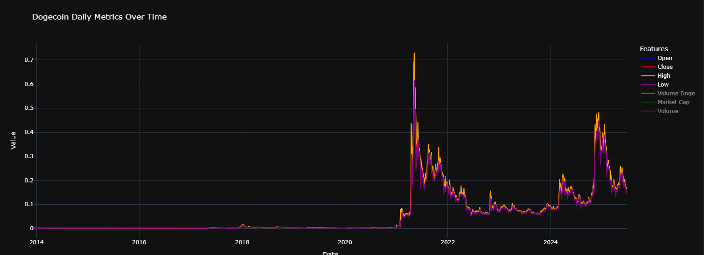

## 📊 Dataset Description

### `doge_dataset_day_pmv.csv`

This dataset contains historical data on Dogecoin (DOGE) in USD, starting from **2013-12-15** up to **2025-06-25**, aggregated from the CoinGecko public API.
 
**🔗 API Reference**: [CoinGecko Public API](https://www.coingecko.com/api/documentation)

It includes the following key daily metrics:

- 📅 **Date** — Daily records from 2013–2025  
- 💲 **Price** — Closing price of Dogecoin in USD  
- 🏦 **Market Capitalization** — Daily market cap value in USD  
- 📊 **24-Hour Volume** — Total DOGE traded over 24 hours (USD)

Interactive data exploration is available in the [`EDA_PMV.ipynb`](./EDA_PMV.ipynb) notebook.

Static preview plot of the full dataset:

### 📊 `doge_dataset_day_ohlcvm.csv`

This dataset provides detailed daily historical data for Dogecoin (DOGE), including the following key metrics:

- **Open**
- **High**
- **Low**
- **Close**
- **Volume (DOGE)**
- **Market Capitalization**

📈 Interactive visualizations and analysis can be found in the [`EDA_OHLCVM.ipynb`](./EDA_OHLCVM.ipynb) notebook.

🖼️ Below is a static preview of the dataset trends:

