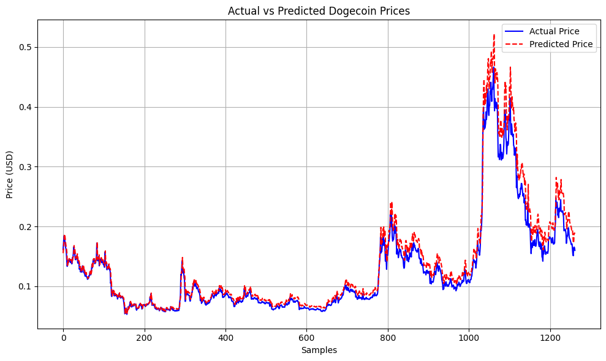

# 🐶📈 Predict-Doge

A machine-learning project to analyze and forecast Dogecoin (DOGE) prices using historical market data and enriched feature sets.

---

## 📂 Dataset

- **Raw Data**: Historical Dogecoin data (2013–2025) sourced from the [CoinGecko API](https://www.coingecko.com/api/documentation).
- **Recent Updates**: Automatically appended  data (price, market cap, volume) using the PyCoinGecko client and daily range endpoint.

---

## 📈 Model Results

A baseline **Linear Regression** model was developed to predict **Dogecoin (DOGE) prices** using historical market capitalization and trading volume as input features.

### 📊 Actual vs. Predicted Price

📘 **Notebook**: Full model training, evaluation metrics, and exploratory analysis are available in [`predict.ipynb`](./predict.ipynb).

📅 **Latest Prediction**  
Using data up to **2025-06-27**, the model predicts the Dogecoin closing price for **today** as:

> 💰 **$0.182815**

---

## 🚀 Project Status

| Component                            | Status            | Description                                                                |
|-------------------------------------|-------------------|----------------------------------------------------------------------------|
| **Data Collection**                  | ✅ Completed       | Full 2013–2025 dataset + automated daily updates (last 365 days)           |
| **Data Cleaning & EDA**              | ✅ Completed       | Removed anomalies, handled missing values, visualized trends with Plotly    |
| **Feature Engineering**              | ✅ Completed       | Added 1-day lags (`market_cap_lag1`, `volume_lag1`), rolling averages (7d)  |
| **Time-Series Split**                | ✅ Completed       | Implemented chronological 80/20 train–test split                            |
| **Baseline Model (Linear Reg.)**     | ⚙️ Done            | R² ≈ 0.93, MSE ≈ 0.0006 using lag features                                  |
| **Advanced Model Prototyping**       | 🔄 In Progress     | Testing Random Forest, XGBoost, and ARIMA                                  |
| **Model Evaluation & Validation**    | ⏳ Pending         | Rolling/​walk-forward cross-validation, error analysis                       |
| **Visualization (Plotly)**           | ✅ Implemented     | Interactive time series and MA plots in `eda.ipynb`                         |
| **README & Documentation**           | ✅ Updated         | Added status table, dataset description, usage instructions                |

---

## 🛠 What’s New

- **Automated Data Pipeline**: Integrated PyCoinGecko wrapper to fetch the most recent 365 days of DOGE data and append to existing records.
- **Lagged & Rolling Features**: Enhanced feature set with 1-day lag variables and 7-day moving averages for price, market cap, and volume.
- **Chronological Train/Test Split**: Switched from random sampling to time-aware split to prevent data leakage.
- **Improved Baseline**: Refined linear regression shows R² ≈ 0.935, a realistic performance metric for forecasting.
- **Modular Notebooks**: Separate `predict.ipynb` for modeling and `eda.ipynb` for exploratory analysis.

---

## 🔮 Future Plans

1. **Model Expansion**  
   - Implement and compare **Random Forests**, **XGBoost**, and **LightGBM**.  
   - Explore **ARIMA**, **Prophet**, and **LSTM** for time-series forecasting.

2. **Enhanced Feature Sets**  
   - Add **multi-lag features** (e.g., 7-day and 30-day lags).  
   - Incorporate **technical indicators** (RSI, MACD) and **sentiment signals** from news/Twitter.

3. **Robust Validation**  
   - Apply **walk-forward cross-validation** to better estimate out-of-sample performance.  
   - Use **backtesting** on historical events (e.g., Elon Musk tweets).

4. **Deployment & Dashboarding**  
   - Build a lightweight **Streamlit** or **Dash** app to visualize live predictions.  
   - Automate daily data fetch and model retraining via GitHub Actions.

5. **Database Enrichment**  
   - Integrate **on-chain metrics** (e.g., transaction volume) and **exchange order-book data**.  
   - Store in a **PostgreSQL** or **MongoDB** backend for scalability.

---

⭐ If you find this project useful, please give it a star!  
