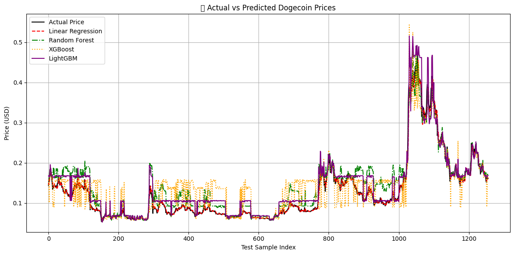

# 🐶📈 Predict-Doge

A machine-learning project to analyze and forecast Dogecoin (DOGE) prices using historical market data and enriched feature sets.

---

## 📈 Model Results

We trained and evaluated four different regression models on the historical Dogecoin dataset using 70% training and 30% test split with lag-based features.

| Model             | Mean Squared Error (MSE) | R² Score |
|------------------|--------------------------|----------|
| Linear Regression| 0.000101                 | 0.9842   |
| Random Forest     | 0.000813                 | 0.8733   |
| XGBoost           | 0.001726                 | 0.7311   |
| LightGBM          | 0.000670                 | 0.8956   |

> All models were trained to predict the next-day **closing price** using 1-day lagged features like market cap, volume, open, high, and low.

### 📊 Actual vs. Predicted Price

📘 **Notebook**: Full model training, evaluation metrics in [`predict_OHLCVM.ipynb`](./predict_OHLCVM.ipynb).

📅 **Latest Prediction**  

Based on yesterday’s market data (2025-06-27), the following models predicted today’s closing price of Dogecoin:

| Model              | Predicted Price (USD) |
|-------------------|------------------------|
| Linear Regression | $0.157493              |
| Random Forest     | $0.162845              |
| XGBoost           | $0.164886              |
| LightGBM          | $0.167169              |

> 📊 These predictions are generated using lag-based features from the latest available data. See [`predict.ipynb`](./predict.ipynb) for implementation details.

---

## 🚀 Project Status

| Component                            | Status            | Description                                                                |
|-------------------------------------|-------------------|----------------------------------------------------------------------------|
| **Data Collection**                  | 🔄 In Progress       | Full 2013–2025 dataset + automated daily updates (last 365 days)           |
| **Data Cleaning & EDA**              | ✅ Completed       | Removed anomalies, handled missing values, visualized trends with Plotly    |
| **Feature Engineering**              | 🔄 In Progress     | Added 1-day lags (`market_cap_lag1`, `volume_lag1`), rolling averages (7d)  |
| **Advanced Model Prototyping**       | 🔄 In Progress     | Testing Random Forest, XGBoost, and ARIMA                                  |

---

## 🔮 Future Plans

1. **Model Expansion**   
   - Explore **ARIMA**, **Prophet**, and **LSTM** for time-series forecasting.

2. **Enhanced Feature Sets**  
   - Add **multi-lag features** (e.g., 7-day and 30-day lags).  
   - Incorporate **technical indicators** (RSI, MACD) and **sentiment signals** from news/Twitter.

3. **Robust Validation**  
   - Apply **walk-forward cross-validation** to better estimate out-of-sample performance.  
   - Use **backtesting** on historical events (e.g., Elon Musk tweets).

4. **Deployment & Dashboarding**  
   - Build a lightweight **Streamlit** or **Dash** app to visualize live predictions.  
   - Automate daily data fetch and model retraining via GitHub Actions.

5. **Database Enrichment**  
   - Integrate **on-chain metrics** (e.g., transaction volume) and **exchange order-book data**.  
   - Store in a **PostgreSQL** or **MongoDB** backend for scalability.

---

⭐ If you find this project useful, please give it a star!  
