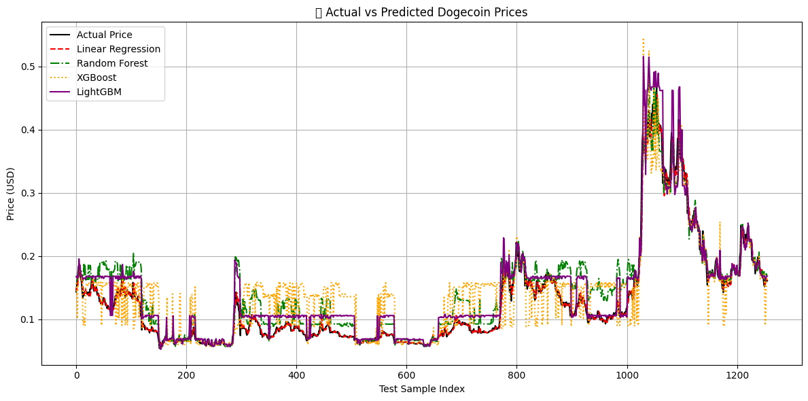

# 🐶 Predict‑Crypto

[](#repository-structure)  
A machine‑learning project to analyze and forecast cryptocurrency prices (Bitcoin & Dogecoin) using historical market data, enriched feature sets, and time‑series models (ARIMA/SARIMA).

---

## 📋 Table of Contents

- [🐶 Predict‑Crypto](#-predictcrypto)
  - [📋 Table of Contents](#-table-of-contents)
  - [🚀 Features](#-features)
  - [📂 Repository Structure](#-repository-structure)
  - [📈 Model Results](#-model-results)
    - [Dogecoin: Regression Performance by Forecast Horizon](#dogecoin-regression-performance-by-forecast-horizon)
  - [🗂️ Project Status](#️-project-status)
  - [🔮 Future Plans](#-future-plans)
  - [⭐ Contributing \& Feedback](#-contributing--feedback)

---

## 🚀 Features

- 📊 **Time‑series forecasting**: ARIMA/SARIMA baseline models  
- 🔍 **Feature engineering**: Lag features, rolling statistics, VWAP  
- 🛠️ **Extensible code**: Shared utilities in `src/`  
- 📒 **Interactive notebooks** for Bitcoin & Dogecoin  
- ☁️ **BigQuery integration** for raw blockchain data  

---

## 📂 Repository Structure

```text
📦 root/
├── 📁 data/
│   ├── 📁 bitcoin/
│   └── 📁 doge/
├── 📁 notebooks/
│   ├── 📁 bitcoin/
│   └── 📁 doge/
├── 📁 src/
├── 📁 img/
├── 📁 bigquery/
└── 📄 README.md
```
---

## 📈 Model Results

### Dogecoin: Regression Performance by Forecast Horizon

| Model              | 1‑Day MSE | 1‑Day R² | 2‑Day MSE | 2‑Day R² | 3‑Day MSE | 3‑Day R² | 4‑Day MSE | 4‑Day R² |
|--------------------|-----------|----------|-----------|----------|-----------|----------|-----------|----------|
| Linear Regression  | 0.000101  | 0.9842   | 0.000186  | 0.9710   | 0.000273  | 0.9574   | 0.000372  | 0.9421   |
| Random Forest      | 0.000724  | 0.8873   | 0.001724  | 0.7313   | 0.003403  | 0.4703   | 0.005207  | 0.1894   |
| XGBoost            | 0.001445  | 0.7749   | 0.001115  | 0.8262   | 0.001804  | 0.7192   | 0.003077  | 0.5210   |
| LightGBM           | 0.000504  | 0.9215   | 0.000717  | 0.8884   | 0.001754  | 0.7269   | 0.003881  | 0.3959   |

> **Deep dive & narrative**:  
> Read the Medium article [When Simplicity Wins…](https://medium.com/@mirazzaman/when-simplicity-wins-linear-regression-tops-complex-models-in-1-day-lag-dogecoin-forecasting-4f7d1965e3a4).

<!-- ---

### 📊 Actual vs. Predicted (1‑Day Lag)

<p align="center">
  
</p> -->

> 📓 Notebook: [`notebooks/doge/predict_OHLCVM.ipynb`](./notebooks/doge/predict_OHLCVM.ipynb)

---

## 🗂️ Project Status

| Component                  | Status        | Notes                                           |
|----------------------------|---------------|-------------------------------------------------|
| **Data Collection**        | 🔄 In Progress | Doge: 2013–2025 daily; BTC: minute‑level        |
| **Feature Engineering**    | 🔄 In Progress | 1‑day lags, 7‑day rolls, VWAP                    |
| **ARIMA/SARIMA Baselines** | 🔄 In Progress | Hyperparameter search in progress               |

---

## 🔮 Future Plans

1. **Model Expansion**  
   - ARIMA/SARIMA, Prophet, LSTM/TCN/Transformer-based forecasters  
2. **Advanced Features**  
   - Technical indicators (RSI, MACD), sentiment analysis  
3. **Robust Validation**  
   - Walk‑forward CV, backtesting on event‑driven windows  
4. **Deployment**  
   - Streamlit/Dash app for live updates; GitHub Actions for retraining  
5. **Data Enrichment**  
   - On‑chain metrics, order‑book snapshots; scalable DB backend  

---

## ⭐ Contributing & Feedback

Feel free to:  
- ⭐ **Star** this repo if you find it useful  
- 🐛 **Report issues** or 📥 **submit PRs**  
- 💬 **Reach out** on [LinkedIn](https://www.linkedin.com/in/mirazzaman) for collaboration  

---

> _Last updated: July 2025_  
